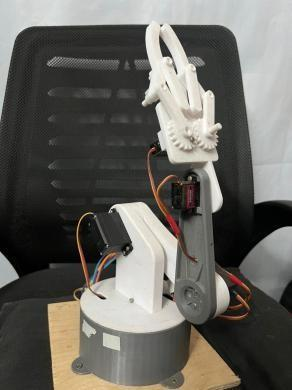
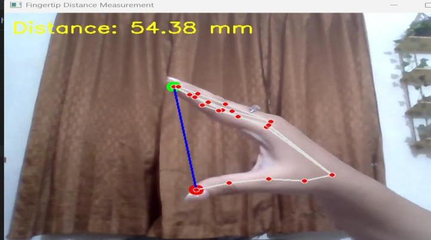
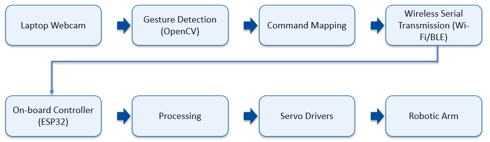
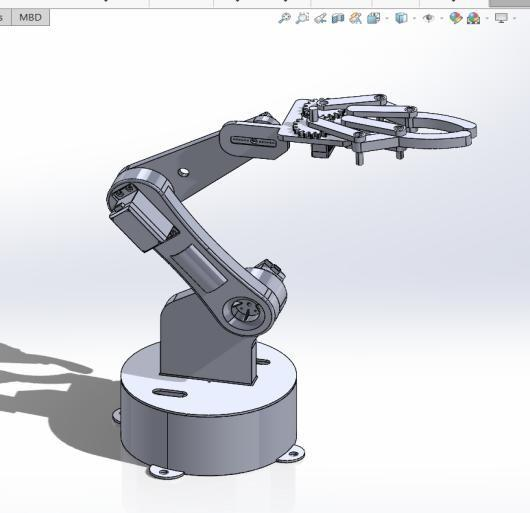
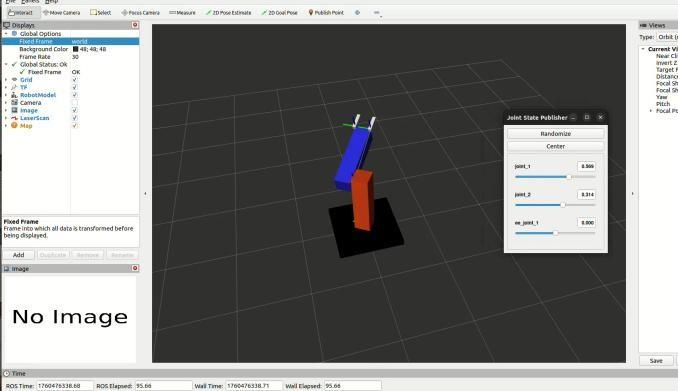

# Hand Gesture Controlled Robotic Manipulator

**Contactless control of a servo-driven robotic arm using real-time computer vision and an ESP32.**


A camera watches your hand, MediaPipe turns it into 21 landmarks, and an ESP32 turns those landmarks into smooth, real-time servo motion — no gloves, buttons, or joysticks required.

<p align="center">
  
  &nbsp;&nbsp;
  
</p>

---

## Overview

This project implements a contactless control interface for a robotic manipulator using vision-based hand tracking. A webcam feed is processed with **MediaPipe** and **OpenCV** to track hand landmarks in real time. The **index-fingertip position** is used as a continuous 2D control input for base and shoulder motion, while the **thumb–index pinch distance** drives the gripper. These are streamed over serial to an **ESP32**, which converts them into PWM commands for three servo motors.

Built for the *Design of Mechatronic Systems (MTE 4108)* sessional, Dept. of Mechatronics Engineering, Khulna University of Engineering & Technology.

**Highlights from testing:**
- 90–95% gesture-tracking accuracy under normal lighting
- Sub-second end-to-end latency (camera → servo motion)
- Reachable workspace: ~180° base rotation × ~90° vertical sweep
- Total build cost: **৳2,800** (~$25 USD)

## How It Works

<p align="center">
  
</p>

1. **Capture** – A webcam streams live video to a Python pipeline.
2. **Detect** – MediaPipe Hands locates 21 landmarks per frame (fingertips + joints).
3. **Map** – The index-fingertip's normalized `(x̂, ŷ)` and the thumb–index pinch distance are linearly scaled into joint commands (see [Kinematics](#kinematics) below).
4. **Transmit** – Commands are sent as a CSV string (`theta1,theta2,theta3\n`) over serial to the ESP32.
5. **Actuate** – The ESP32 parses the string and drives three PWM servos: base yaw, shoulder pitch, and gripper.

## Kinematics

The arm is modeled as a yaw–pitch–pitch chain (θ₁ base yaw, θ₂ shoulder pitch, θ₃ elbow/gripper). The **forward kinematics** map joint angles to the end-effector pose and were used to validate the reachable workspace:

```
φ = θ2 + θ3
r = L1·cos(θ2) + L2·cos(φ) + L3·cos(φ)      # horizontal reach
z = L1·sin(θ2) + L2·sin(φ) + L3·sin(φ)      # height
x = r·cos(θ1),   y = r·sin(θ1)
```

Teleoperation itself uses the **inverse (task-to-joint) direction** — a simple linear scaler from screen-space input to joint space, *not* full inverse kinematics:

| Input                          | Range      | Output               | Range      |
|---------------------------------|------------|-----------------------|------------|
| Fingertip x̂ (normalized)        | `[0, 1]`   | θ₁ – base yaw          | `[0°, 180°]` |
| Fingertip ŷ (normalized)        | `[0, 1]`   | θ₂ – shoulder pitch    | `[0°, 180°]` |
| Pinch distance `w`               | `[0, 60] mm` | θ₃ – gripper           | `[0°, 120°]` |

## Hardware

<p align="center">
  
  &nbsp;&nbsp;
  
</p>

| # | Component              | Qty | Unit Price (BDT) | Total (BDT) |
|---|-------------------------|-----|-------------------|-------------|
| 1 | 3D-printed body structure | 1   | 1000              | 1000        |
| 2 | MG996R Servo             | 3   | 400               | 1200        |
| 3 | ESP32 Dev Board          | 1   | 450               | 450         |
| 4 | Webcam                   | 1   | –                 | –           |
| 5 | Breadboard & wires       | as req. | 150           | 150         |
| **Total** |                  |     |                   | **৳2,800**  |

The mechanical design (link lengths 12 cm / 10.4 cm, 15.7 cm wrist, 5.7 cm base) was modeled in SolidWorks and validated in ROS/RViz via a URDF model before hardware assembly.

## Repository Structure

```
hand-gesture-robotic-arm/
├── python/
│   └── hand_tracker.py          # Webcam capture, MediaPipe tracking, serial bridge
├── firmware/
│   └── esp32_servo_controller/
│       └── esp32_servo_controller.ino   # Serial parser + 3-servo PWM control
├── docs/
│   └── images/                  # Figures used in this README
├── requirements.txt
└── LICENSE
```

## Getting Started

### Hardware setup
1. Wire the base, shoulder, and gripper servos to the ESP32 (default pins: `3`, `5`, `6` — adjust in the sketch to match your wiring).
2. Power the servos from a regulated 5–6V supply (do **not** power servos directly from the ESP32's 3.3V/5V pin for anything beyond light loads).
3. Flash `firmware/esp32_servo_controller/esp32_servo_controller.ino` to the ESP32 using the Arduino IDE (`Servo` library, install via Library Manager if needed).

### Software setup
```bash
git clone https://github.com/<your-username>/hand-gesture-robotic-arm.git
cd hand-gesture-robotic-arm
pip install -r requirements.txt
```

### Run it
```bash
python python/hand_tracker.py --port /dev/ttyUSB0 --baud 115200
# Windows: --port COM3
# No hardware on hand? Preview the vision pipeline only:
python python/hand_tracker.py --no-serial
```

Press **ESC** in the video window to quit.

## Results

- Consistent fingertip detection under normal lighting, **90–95%** gesture-tracking accuracy.
- End-to-end delay from gesture to mechanical response: **< 1 second**.
- Stable PWM output across all three joints with negligible serial packet loss.
- Main failure mode: low-light or very fast hand motion occasionally introduced small tracking jitter.

## Applications

- Education and lab demonstrations of human–robot interaction
- Contactless control in hygiene-critical or hazardous environments
- Light pick-and-place tasks with a simple gripper

## Future Work

- Replace the linear task-to-joint scaler with full inverse kinematics for smoother, more precise positioning
- Add gesture-based mode switching (e.g., open-hand = home position, fist = hold/lock)
- Move from wired serial to Wi-Fi/BLE for a fully wireless link (already sketched in the block diagram)
- Higher frame-rate camera to reduce tracking jitter during fast motion

## Team

Group 3 — Department of Mechatronics Engineering, Khulna University of Engineering & Technology
Supervised by Dr. Asief Javed and Anisha Anjum Meem

## License

This project is licensed under the [MIT License](LICENSE).
